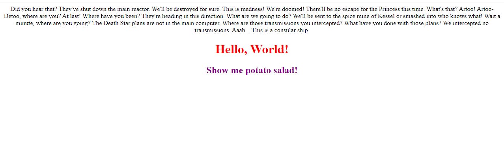

# README

Building a boilderplate web application and updating the DOM with Javascript

## First Objective - Build a boilerplate web application
1. Output will be 3 files -> html file (already provided), javascript file, css file
2. See the Expected Visual Output below
2. HTML file 
    - should contain no text content in the ```<body>```
        - I.E. do not add ```<h1>Hello World</h1>``` inside of the ```<body>``` tag
3. The Javascript file 
    - should be loaded by the index.html file
    - ```<h1>Hello, World.</h1>``` needs to be added to the ```<body>``` of the application using javascript
    - ```<h2>Show me potato salad!</h2>``` needs to be added to the ```<body>``` of the application using javascript and it should appear below the ```<h1>```
        
    - A random paragraph of text (using a loremm ipsum) needs to be added to the ```<div id='element'>```
        - "Lorem Ipsum" is commonly used generated placeholder text -> read more ->   https://loremipsum.io/
4. The CSS file
    - should be loaded by the index.html file
    - Should change the color of the ```<h1>``` to be "red"
    - should change the color of the ```<h2>``` to be "purple"
    - should center all the text

## Expected Visual Output 


## Resources

- Lorem Ipsum - https://loremipsum.io/
- how to build a basic website - https://docs.microsoft.com/en-us/learn/modules/build-simple-website/ 
- the DOM - https://www.w3schools.com/js/js_htmldom.asp