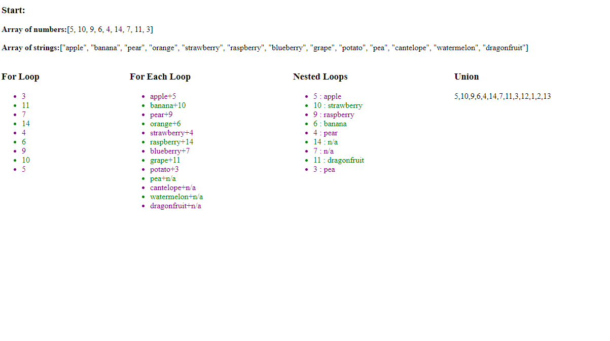

# README

Loops

## Objectives
1. Inside of the scripts.js file there are 4 loop exercises
2. For extra fun you can write css to alternate the colors of the list elements

## Expected Visual Output 

## Some Resources
- w3schools forEach - https://www.w3schools.com/jsref/jsref_foreach.asp
- unions, intersections and differences - https://medium.com/@alvaro.saburido/set-theory-for-arrays-in-es6-eb2f20a61848
- nth child - https://www.w3schools.com/cssref/sel_nth-child.asp